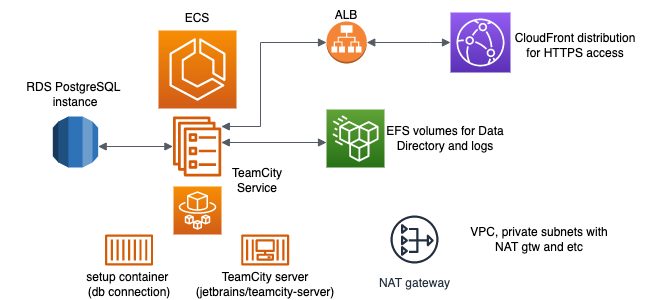

# AWS CloudFormation TeamCity template (Cloud Development Kit)

This is a project for generating TeamCity CloudFormation template for quick setup in AWS account.
Created using CDK (Cloud Development Kit) with Java.

# AWS Resources architecture

# How to use
* install the [CDK toolkit](https://docs.aws.amazon.com/cdk/v2/guide/cli.html)
* run `cdk synth` command to generate the CloudFormation template
* use the **cdk.out/CdkTeamcityTemplateStack.template.json** file when creating a Stack in AWS CloudFormation

## Configuration
The `cdk.json` file tells the CDK Toolkit how to execute your app.

## Other useful commands

* `mvn package`     compile and run tests
* `cdk ls`          list all stacks in the app
* `cdk synth`       emits the synthesized CloudFormation template
* `cdk deploy`      deploy this stack to your default AWS account/region
* `cdk diff`        compare deployed stack with current state
* `cdk docs`        open CDK documentation